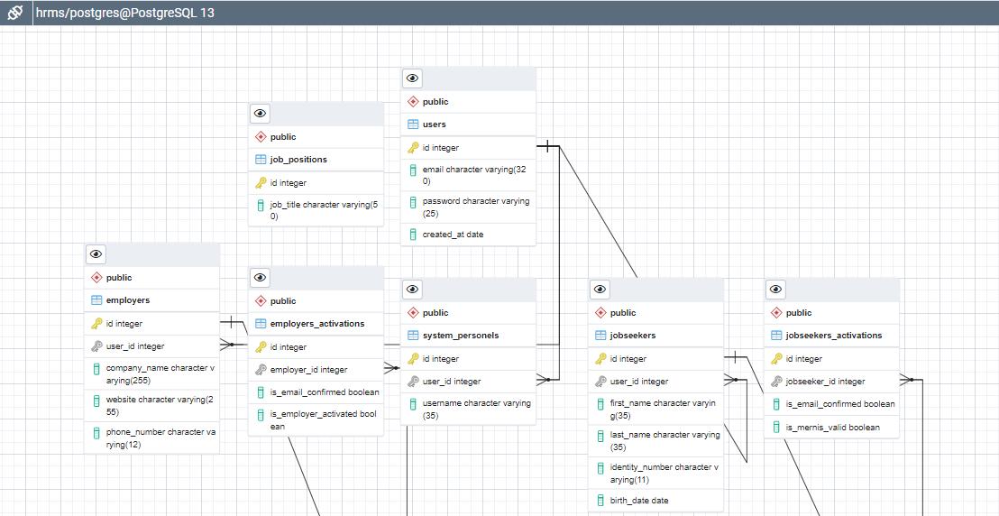
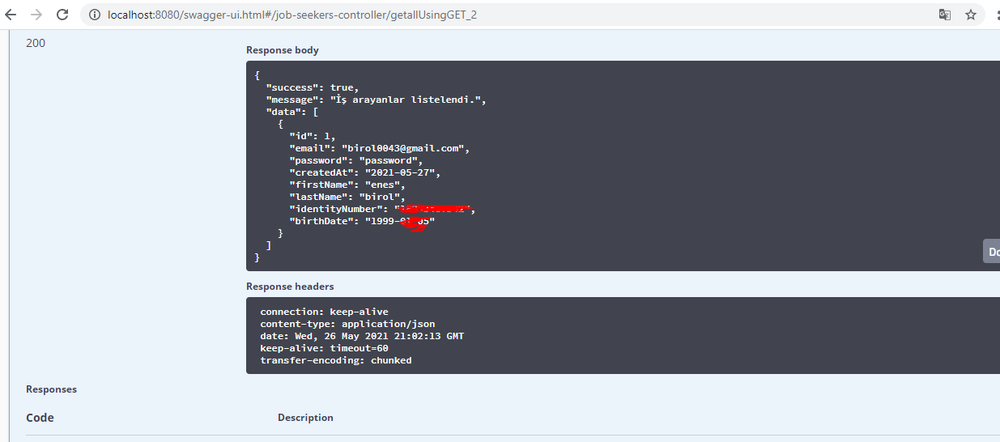
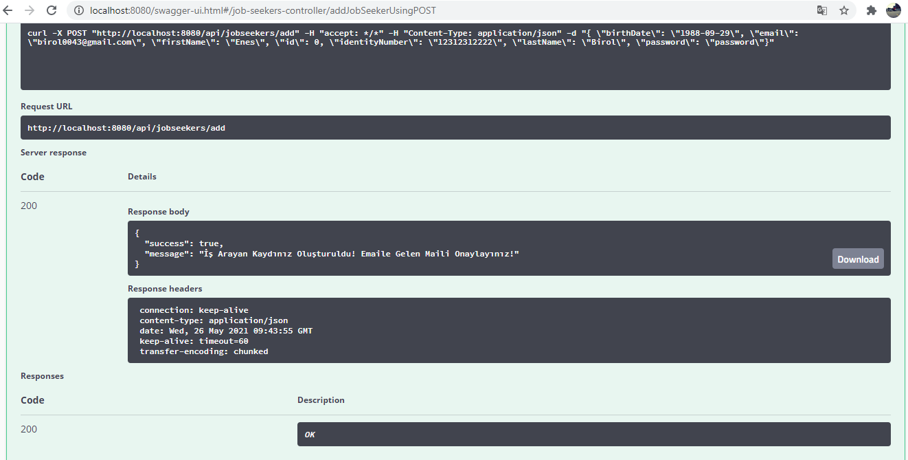
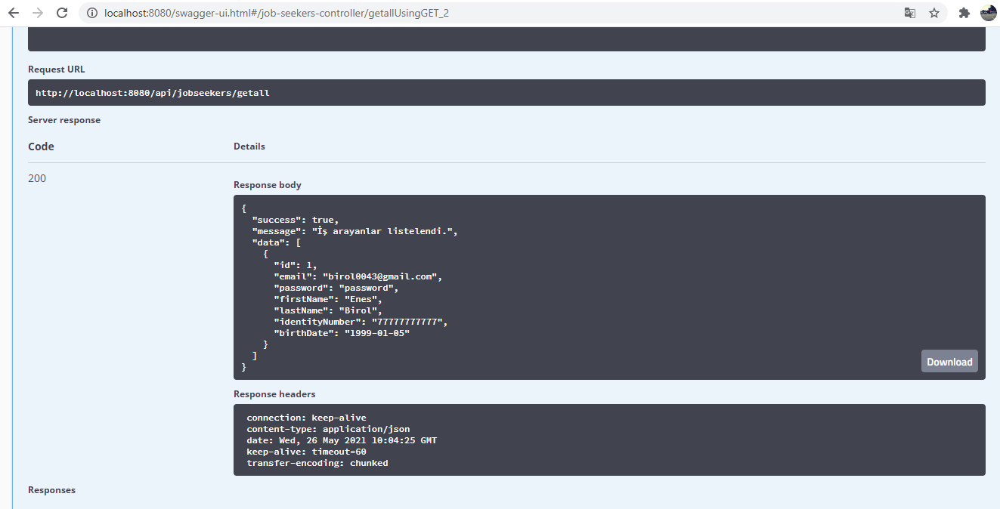
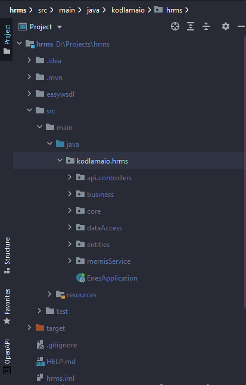
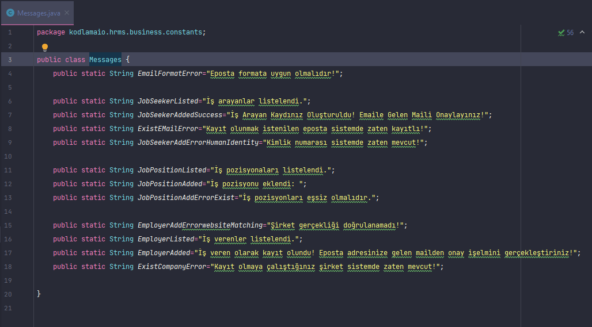

<h2> Human Resources Management System (HRMS)  </h2>
 

</img>

<h2>File Directory</h2>
<ul>
    <li><b>Real Person Checker System (KPS)  </b></li>
        <ul>
            <li><a href='https://github.com/EnesBirol/hrms/tree/master/src/main/java/kodlamaio/hrms/mernisService'> MernisService </a>            </li>
        </ul>
    <li><b>Main</b></li>
        <ul>
            <li><a href='https://github.com/EnesBirol/hrms/blob/master/src/main/java/kodlamaio/hrms/EnesApplication.java'> EnesApplication.java </a></li>
        </ul>
    <li><b>Business</b></li>
        <ul>
            <li>Abstract</li>
                <ul>
                    <li><a href="https://github.com/EnesBirol/hrms/blob/master/src/main/java/kodlamaio/hrms/business/abstracts/JobPositionService.java">JobPositionService.java</a></li>
                </ul>
            <li>Concretes</li>
                <ul>
                    <li><a href="https://github.com/EnesBirol/hrms/blob/master/src/main/java/kodlamaio/hrms/business/concretes/JobPositionManager.java">JobPositionManager.java</a></li>
                </ul>
        </ul>
    <li><b>Data Access</b></li>
        <ul>
            <li>Abstract</li>
                <ul>
                    <li><a href="https://github.com/EnesBirol/hrms/blob/master/src/main/java/kodlamaio/hrms/dataAccess/abstracts/JobPositionDao.java">JobPositionDao.java</a></li>
                </ul>
        </ul>
    <li><b>Entities</b></li>
        <ul>
            <li>Concretes</li>
                <ul>
                    <li><a href="https://github.com/EnesBirol/hrms/blob/master/src/main/java/kodlamaio/hrms/entities/concretes/JobPosition.java">JobPosition.java</a></li>
                </ul>
        </ul>
    <li><b>API / Controllers</b></li>
        <ul>
            <li><a href='https://github.com/EnesBirol/hrms/blob/master/src/main/java/kodlamaio/hrms/api/controllers/JobPositionsController.java'> JobPositionsController.java </a>            </li>
        </ul>  
     
  
    

        
Database Design

        </img>
    

    

    

        
Database SQL File

        </img>
    

    

    

      
Project Photos Details

        </img>
        </img>
        </img>
        </img>
        </img>
    

    
<ul>
